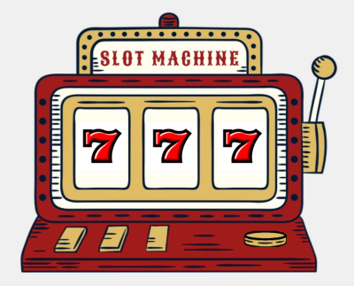

# Slot Machine 🎰

Um projeto simples e divertido de uma máquina caça-níqueis desenvolvida com HTML, CSS e JavaScript (jQuery).

A interface simula os rolos clássicos de uma slot machine e permite ao usuário iniciar a rotação com um clique, trazendo uma experiência visual leve e interativa. 

Ideal para fins educacionais, experimentos com animações e aprendizado de manipulação DOM com jQuery.
